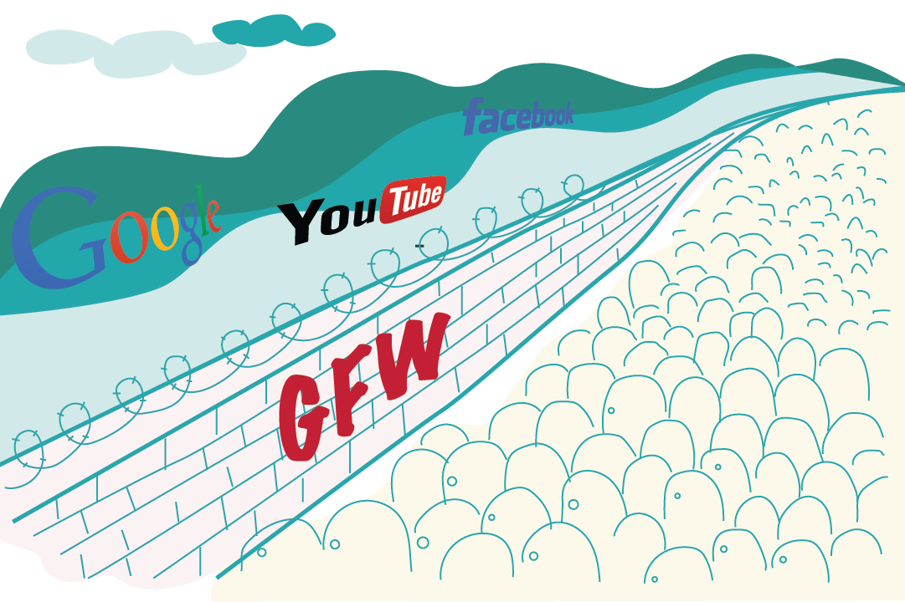
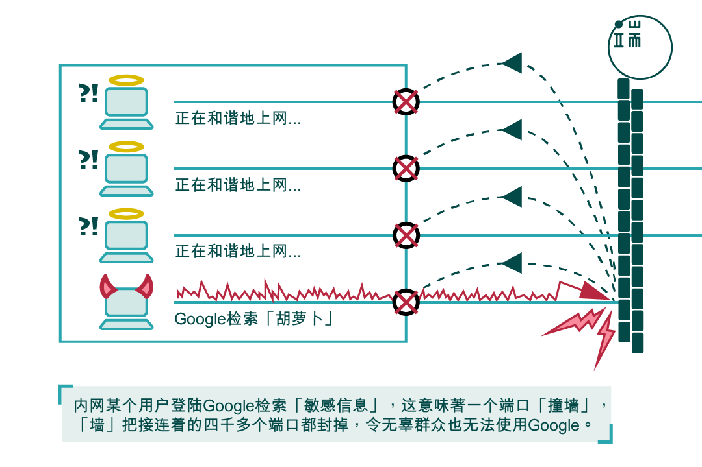
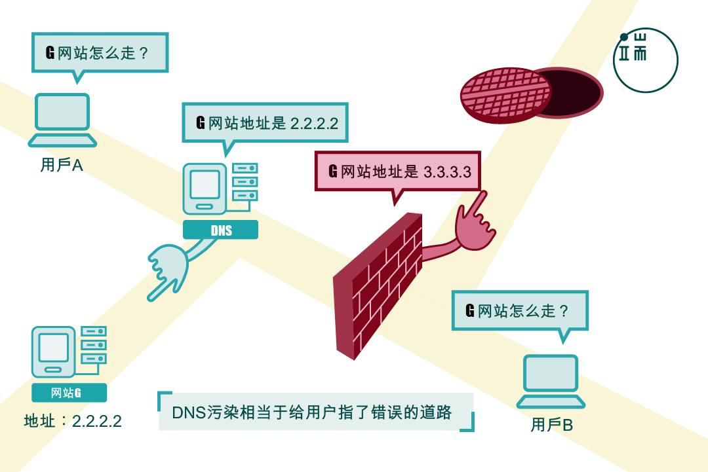
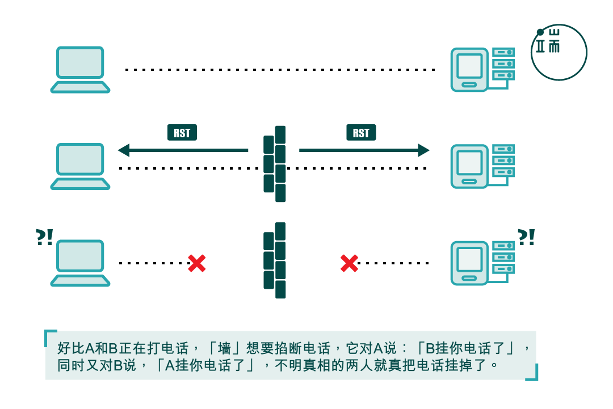

# 有关科学上网的说明与解释

<figure><figcaption></figcaption></figure>

<figure><figcaption></figcaption></figure>

手机用户请在浏览器中输入短网址 或使用微信、支付宝等二维码工具扫描二维码打开页面, 点击右上角"...", 在弹出菜单中点击“在浏览器打开”； 若网页被举报禁止访问，请点击“恢复申请访问”，将链接复制并粘贴到浏览器中打开（请不要使用QQ或360浏览器，建议使用谷歌Chrome、苹果Safari、微软Edge等官方浏览器

提示：微信如提示停止访问该网页，须先点击右上角三个点，选择浏览器打开。国产浏览器可能已屏蔽本项目，建议使用谷歌Chrome、苹果Safari、微软Edge等官方浏览器。或[制作本项目的同步镜像](start/mirror.md)，获得一个新的网址来推广。

同步地址:

1.[https://winver-dev.gitbook.io](https://github.com/hjm2007/pac)

2.[https://github.com/hjm2007/pac](https://github.com/hjm2007/pac)

## **注意：**

①不得将我们提供的服务用于任何非法或侵权或违反社会公益等活动，包括但不限于将其用于展示传播包含色情、种族主义、低级趣味、淫秽、诽谤中伤、污辱性质、赌博、教唆犯罪或进行犯罪活动的信息，以及传播任何针对宗教、民族传统、人种、性别、年龄的各种仇恨、歧视和偏见的内容！

②请在使用时注意辨别政治相关信息，请勿进行任何损害国家利益的事情。所有资料均来自互联网，不定期更新。

③不要老是问我为什么有些没有或者失效了，因为我只能保证可以打开一些被封锁的网站。

## 一.什么是GFW

GFW是“Great Firewall of China”的简称，中文名叫做“防火长城”。它是中国政府通过技术手段建立的网络审查系统，目的是通过对互联网进行封锁和过滤，来限制中国境内的人民能够访问哪些内容。GFW主要针对的是政治敏感话题、社会意识形态等方面的信息。

GFW的原理是通过对网络数据进行深度包检测（DPI）的方式，筛选出被视为敏感或不合规的数据包，从而对其进行封锁或过滤。具体来说，GFW会监控中国境内的互联网流量，并根据设置好的过滤规则，对数据包的源地址、目标地址、端口号、协议类型、关键字等进行检测和比对。一旦被认定为非法或敏感内容，GFW就会阻止这些数据包在中国境内传输或接收。

除了DPI之外，GFW还使用了其他技术手段，如DNS污染、IP封锁、HTTP代理、SSL篡改等，来加强网络封锁效果。

（简单来说，就是祖国为了保护我们而对部分网上内容进行了阻挡使其无法访问或效果不佳。）

更多解释请看1.[https://zh.wikipedia.org/wiki/%E9%98%B2%E7%81%AB%E9%95%BF%E5%9F%8E](https://zh.wikipedia.org/wiki/%E9%98%B2%E7%81%AB%E9%95%BF%E5%9F%8E)

2.[https://theinitium.com/zh-Hans/article/20150904-mainland-greatfirewall](https://theinitium.com/zh-Hans/article/20150904-mainland-greatfirewall)

## **二.原理：**

### 一 关键字过滤阻断

关键字过滤系统。此系统能够从出口网关收集分析信息，过滤、嗅探指定的关键字。主要针对HTTP的默认端口：80端口，因为HTTP传播的内容是明文的内容，没有经过加密，而GFW是一个IDS(Intrusion detection system)。普通的关键词如果出现在HTTP请求报文的头部(如“Host: www.youtube.com”\\)时，则会马上伪装成对方向连接两端的计算机发送RST包\\(reset\\)干扰两者正常的TCP连接，进而使请求的内容无法继续查看。如果GFW在数据流中发现了特殊的内文关键词\\(如轮子，达赖等\\)时，其也会试图打断当前的连接，从而有时会出现网页开启一部分后突然停止的情况。在任何阻断发生后，一般在随后的90秒内同一IP地址均无法浏览对应IP地址相同端口上的内容。

<figure><figcaption>
GFW早期关键字过滤阻断以及连坐(图片来源:<a href="https://theinitium.com/zh-Hans/article/20150904-mainland-greatfirewall">https://theinitium.com/zh-Hans/article/20150904-mainland-greatfirewall</a>)
</figcaption></figure>

### 二 IP地址封锁

IP地址封锁是GFW通过路由器来控制的，在通往国外的最后一个网关上加上一条伪造的路由规则，导致通往某些被屏蔽的网站的所有IP数据包无法到达。路由器的正常工作方式是学习别的路由器广播的路由规则，遇到符合已知的IP转发规则的数据包，则按已经规则发送，遇到未知规则IP的数据，则转发到上一级网关。

而GFW对于境外(中国大陆以外)的XX网站会采取独立IP封锁技术。然而部分XX网站使用的是由虚拟主机服务提供商提供的多域名、单(同)IP的主机托管服务，这就会造成了封禁某个IP地址，就会造成所有使用该服务提供商服务的其它使用相同IP地址服务器的网站用户一同遭殃，就算是正常的网站，也不能幸免。其中的内容可能并无不当之处，但也不能在中国大陆正常访问。现在GFW通常会将包含XX信息的网站或网页的URL加入关键字过滤系统，并可以防止民众透过普通海外HTTP代理服务器进行访问。

### 三 特定端口封锁

GFW会丢弃特定IP地址上特定端口的所有数据包，使该IP地址上服务器的部分功能(如SSH的22、VPN的1723或SSL的443端口等)无法在中国大陆境内正常使用。

在中国移动、中国联通等部分ISP(手机IP段)，所有的PPTP类型的VPN都被封锁。

2011年3月起，GFW开始对Google部分服务器的IP地址实施自动封锁(按时间段)某些端口，按时段对www.google.com(用户登录所有Google服务时需此域名加密验证)和mail.google.com的几十个IP地址的443端口实施自动封锁，具体是每10或15分钟可以连通，接着断开，10或15分钟后再连通，再断开，如此循环，令中国大陆用户和Google主机之间的连接出现间歇性中断，使其各项服务出现问题。GFW这样的封锁手法很高明，因为Gmail并非被完全阻断，这令问题看上去好像出自Google本身。这就是你们认为Google抽风的原因。

### 四 SSL连接阻断

GFW会阻断特定网站的SSL加密连接，方法是通过伪装成对方向连接两端的计算机发送RST包(RESET)干扰两者间正常的TCP连接，进而打断与特定IP地址之间的SSL(HTTPS，443端口)握手(如Gmail、Google文件、Google网上论坛等的SSL加密连接)，从而导致SSL连接失败。

当然由于SSL本身的特点，这并不意味着与网站传输的内容可被破译。

### 五 DNS劫持和污染

GFW主要采用DNS劫持和污染技术，使用Cisco提供的IDS系统来进行域名劫持，防止访问被过滤的网站，2002年Google被封锁期间其域名就被劫持到百度。中国部分ISP也会通过此技术插入广告。

对于含有多个IP地址或经常变更IP地址逃避封锁的域名，GFW通常会使用此方法进行封锁。具体方法是当用户向DNS服务器提交域名请求时，DNS返回虚假(或不解析)的IP地址。

全球一共有13组根域名服务器(Root Server)，目前中国大陆有F、I这2个根域DNS镜像，但现在均已因为多次DNS污染外国网络，而被断开与国际互联网的连接。

DNS劫持和污染是针对某些网站的最严重的干扰。

干扰的方式有两种：

一种是通过网络服务提供商(Internet Service Provider)提供的DNS服务器进行DNS欺骗，当人们访问某个网站时，需要要把域名转换为一个IP地址，DNS服务器负责将域名转换为IP地址，中国大陆的ISP接受通信管理局的屏蔽网站的指令后在DNS服务器里加入某些特定域名的虚假记录，当使用此DNS服务器的网络用户访问此特定网站时，DNS服务便给出虚假的IP地址，导致访问网站失败，甚至返回ISP运营商提供的出错页面和广告页面。

另一种是GFW在DNS查询使用的UDP的53端口上根据blacklist进行过滤，遇到通往国外的使用UDP53端口进行查询的DNS请求，就返回一个虚假的IP地址。

<figure><figcaption>
DNS污染(图片来源:<a href="https://theinitium.com/zh-Hans/article/20150904-mainland-greatfirewall">https://theinitium.com/zh-Hans/article/20150904-mainland-greatfirewall</a>)
</figcaption></figure>

### 六.RST攻击

RST 攻击是 GFW 最常见也是运用最广泛的屏蔽手段之一, 因此一一列举它的所有应用场合是不可能的. 此处将会举出影响最大的几种.

1. 使用 TCP 的 DNS
2. 包含敏感词的 HTTP 请求. 这在互联网逐渐 HTTPS 化之后逐渐失去了意义
3. [SNI](https://en.wikipedia.org/wiki/Server\_Name\_Indication)和 HTTPS 证书中包含被屏蔽网址的 HTTPS 请求

其中第三种场景在当下造成的影响最为严重。

<figure><figcaption>
RST攻击(图片来源:<a href="https://theinitium.com/zh-Hans/article/20150904-mainland-greatfirewall">https://theinitium.com/zh-Hans/article/20150904-mainland-greatfirewall</a>)
</figcaption></figure>

## 三.我们为什么要越过GFW

对于二次元迷来说，翻墙上网的原因可能更多地涉及到获取二次元相关的内容和服务。在一些地区或国家，观看、下载或分享二次元相关的内容可能被视为违法或不合规的行为，因此需要使用翻墙软件或服务来突破网络封锁。

此外，一些二次元相关的网站或社区也可能限制了访问，例如在中国地区屏蔽了一些二次元相关的网站。通过翻墙，二次元迷可以轻松地浏览和参与这些网站和社区，获取更广泛的信息和交流机会。

## **四.我国对科学上网的态度**

科学上网肯定违法。如果违法，那中国政府就有几千万人要抓，经济上没有可行性。如果强制立法翻墙违法，中国政府也不会不知道其中的政治代价，除非它想让整个中国进入黑暗时代。所以基本上个人翻墙违不违法是个伪命题，日常查个Gmail，看个Youtube没必要提心吊胆，不要被网络上所谓“翻墙罪”危言耸听蛊惑，这多是国外无良媒体想带节奏。但是，私自开设翻墙设备盈利，或者大面积分发翻墙下载包的，无论何种渠道，迟早被查，案例已经有不少，千万不要侥幸：

* [为近3万人提供VPN“翻墙”服务，男子被杭州检方批捕](https://chinadigitaltimes.net/chinese/2019/11/%E6%96%B0%E4%BA%AC%E6%8A%A5-%E4%B8%BA%E8%BF%913%E4%B8%87%E4%BA%BA%E6%8F%90%E4%BE%9Bvpn%E7%BF%BB%E5%A2%99%E6%9C%8D%E5%8A%A1%EF%BC%8C%E7%94%B7%E5%AD%90%E8%A2%AB%E6%9D%AD%E5%B7%9E/)
* [男子销售SS软件获刑](https://www.williamlong.info/archives/5239.html)
* [网际飞梭作者被抓](https://lusongsong.com/blog/post/9095.html)
* [ShadowSocks作者被请喝茶](https://zh.wikipedia.org/zh/Shadowsocks)
* ShadowSocksR作者被人肉搜索

都是真实的案例，因为涉及的网站、软件被撤或被关是能直接观察到，且有几位涉事者后来都有澄清，所以可以确定不是空穴来风。据我所知，知乎上甚至有人因为卖建站主机入狱的，原因是名下的建站主机公司销售香港地区的服务器，被大量客户买去翻墙用，最终导致公司被关，自己也坐了一年的牢。如果你的心里正酝酿着做翻墙的生意，还是就此打住吧，如果你是网络主机提供商，也要管好自己的服务器，如果你是身怀绝技的码农，最好也别碰这类软件的开发，除非你已人肉翻墙，以后不打算回国了。但不过总有一些B哥作死，比如[这位](https://space.bilibili.com/1493375920/video)在学校翻墙，还搜敏感信息，我建议你不要学，因为学校每年都会有上级部门的网络安全审查，这人拿学校的网来翻墙不就是来找事嘛，而且学校的网络正常要么接入的是移动联通电信的政企专线，要么是CERNET教育骨干网（这个一般是大学用的），这种网络有流量监控，你在里面干了什么很容易就查到了，翻墙更是分分钟抓住。

## 五.中国安全翻墙上网须知

#### <mark style="color:red;">注意:你有一个好用的工具，或者有一组闲置的服务器，可以私下里分享给朋友使用，但绝对不要在微信、微博、知乎，简书等国内网络社区里散布，后果轻则删贴封号，重则 … 其实没人知道，不排除被请喝茶，罚款，甚至牢狱之灾。其实往往是你越分享的东西失效地越快，尤其是SSR私服，国内所有网站都有人工审查，IP地址一旦被注意到，很快会被墙。</mark>

### 不要在国内网络散布信息

### 警惕网上所谓“免费VPN”，“免费节点”

被分享到国内公网上的所谓“免费VPN”，“免费节点”很少可靠的，省钱没错，但不假思索地使用来源不可靠的网站上分享的东西，会给你上网带来风险，你的上网隐私可能被泄漏，流量经过恶意服务器，还可能被破解，你可能丢失敏感信息，如密码，验证码，银行账号等。不是说所有免费的东西都这样，但在你安装客户端或把它们导入配置之前还是多长个心眼。

### 尽量不要用国产软件

国产软件不都是流氓软件，但它们很多确实是流氓软件，它们几乎不受任何法律法规约束，一旦装进你的电脑或手机设备，它们就开始为所欲为，扫描你的硬盘，监听你的流量，窃取你的资料。如果你把这些软件和上网工具装在一起，这些软件一定就知道你在翻墙，可能在后台把你个人信息和使用的上网软件发送到远程服务器，因为网络监管，这些国内厂商在任何时候都可能将你的上网记录提供给政府或第三方，这将给你人身安全带来什么隐患，只能由你自己去想象。国内已知的流氓软件公司有：百度，360，腾讯，阿里巴巴都是，只是流氓程度不同而已，如果你感兴趣请看知乎：[最流氓的软件可以流氓到什么程度？](https://www.zhihu.com/question/29129310)。

### 不要在国内网站上下载浏览器客户端

你可以从很多国内下载站上下载到Chrome，Firefox等流行浏览器的客户端，虽然这听起来很方便，因为省去翻墙，但我建议你不要这么做。因为下载包的提供者甚至浏览器软件有着庞大用户基数，利益驱动下，可能通过技术手段对安装文件动手脚，植入广告软件或木马后门，这些恶意程序基本上都会往恶意厂商后台发送用户信息，这些信息里可能包含你对浏览器的使用记录，而这些记录随时可能被官方调用。我建议你先翻墙，再到[Chrome官网](https://www.google.com/intl/zh-CN/chrome/)，[Firefox官网](https://www.mozilla.org/en-US/firefox/new/)去下载安装客户端。

### 敏感时期:

所谓“敏感时期”就是翻墙软件具体失灵的时期，敏感时期内几乎所有科学上网的企图都会破灭，所有的软件会遭遇禁闭，连不上，速度极慢，频繁断线等问题集中出现，这些时候基本上中国互联网处于“军事戒严”状态，信息出入境极其不自由，是技术上的国家局域网，每次敏感时期可持续约1-2周后恢复，大家有都可以像什么都没发生过那样翻墙科学上网了。

**每年春节期间**

每年春节的网络都不会太好，为了保证春节节日期间的平安祥和，你的翻墙软件会变得很不配合，建议这时候多走亲戚多串门陪爸妈做好吃的，春节一过你回到城市上班的那天，你会发现网络其实很通畅。

**每年3月上旬开会期间**

这是中央开会的时候，外网基本上不去，两会期间尤其紧，一线的翻墙VPN和绝大多数商业科学上网工具会彻底嗝屁，基本没有可连的节点。只剩一众比较隐蔽的私人自架服务器还勉强能连，但一般也慢得可怜，断线断得你锤头丧气。这时候还是建议少上网，多看央视直播，关心国家大事，似懂非懂地和你的男同事们坐而论道撸串比较好。

**每年六月上旬**

西方人最爱替中国过的一个节日叫：~~六四纪念日~~(你知道的太多了)。美英法德澳俄甚至中东的恐怖分子电台都会反复播放所谓“勇敢的坦克人”的照片和录像画面，所有社交媒体的推送系统都会出来互相站台，这是西方舆论压箱底的宝贝，我国政府一口难敌百嘴，不胜其扰之下，干脆关网了事。如果你对~~六四~~(你知道的太多了)这段历史感兴趣，请看看[这个视频](https://www.youtube.com/watch?v=azP\_gTPEL\_Q)(已失效)，<mark style="color:red;">**这位姓柴的同学鼓动大家起来造反，让别人流血，自己逃到美国，认美国人当了爹，过起了《自由民主》的生活，让我们永远不要忘记她（个鬼）。**</mark>这是一个~~六四潧萫~~(你知道的太多了)的[Youtube页面](https://www.youtube.com/results?search\_query=%E5%85%AD%E5%9B%9B%E7%9C%9F%E7%9B%B8)，可惜它们都是中文的，西方所谓“民主斗士们”只看得懂英文报道。

**每年国庆期间**

国庆七天假，大概会断外网一个礼拜左右。一般从9月最后一两天开始无法正常翻墙，一直持续到10月5日、6日的样子。建议这时候开车远游，因为国庆节时候的高速路是“免费的风景线”，也可以做死宅，毕竟不是春节，外卖照常送，淘宝天猫京东打折天天有，祖国长一岁，你也胖三斤。

**突发政治事件**

没人能预测这类事件会在什么时候发生，我们只知道，如果不是在上面的时间里却突然发现无法翻墙了，那么一定是有什么事情发生。我们不知道是什么，但我自己现在的第一判断都是“不知道在哪里西方对我们的新一轮攻势又开始了”，或者我党内部是不是又出幺蛾子了，或者哪个地方是不是又出安全事件了。这时候最好的办法是“等”，一般几天过后网络就会恢复，我们中国人又能若无其事地继续我们各自的生活：加班，赚钱，吃吃吃，不谈恋爱。

## **六.YouTube频道和网站推荐(不定期更新)**

YouTube频道:[ぺぽよ](https://www.youtube.com/@pepoyoPPY),[ちのい](https://www.youtube.com/@ul0ux),[椰椰子](https://www.youtube.com/@abigcoconut1538/)

网站:[NicoNico](https://www.nicovideo.jp/),[Pixiv](https://www.pixiv.net/),[Google](https://www.google.com/),[Internet Archive](https://archive.org/),[端传媒](https://theinitium.com/),[BBC中文网](https://www.bbc.com/zhongwen/simp/),[华尔街日报](https://cn.wsj.com)

## 七.一些说明

1.V2rayN支持协议较多所以我建议使用V2rayN进行科学上网。

2.如果你想要用Clash，Windows 或 Mac端建议使用Clash Verge，安卓端请使用Clash Meta For Android

3.Shadowsocks订阅更新功能有问题所以不推荐使用

4.对于其他翻墙软件评测如下：

* 自由门：无效，非中立
* 无界：半有效，非中立
* 赛风：无效，非中立
* nthlink：半有效，非中立

<mark style="color:red;">**提示：不是不可以使用上述非中立的软件，但你要是这么做了，我不能保证你不会去橘子喝茶。**</mark>

5.已经灭绝的方法：

1.GoAgent

。。。。。。

(待更新)

6.如果在手机端打开Google重定向到"www.google.cn/m",请打开"www.google.com.hk"

