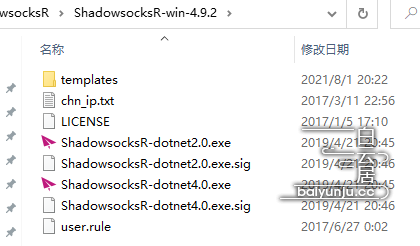
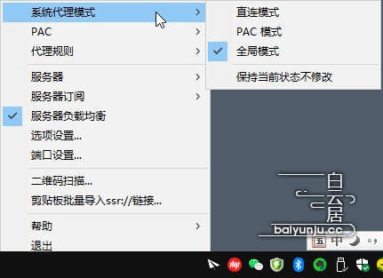
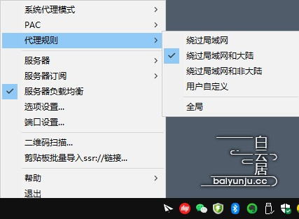
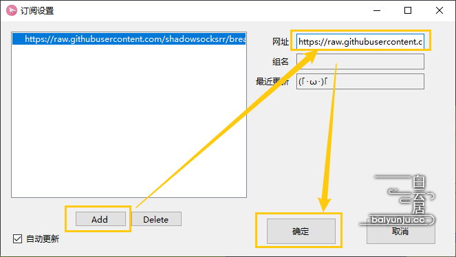
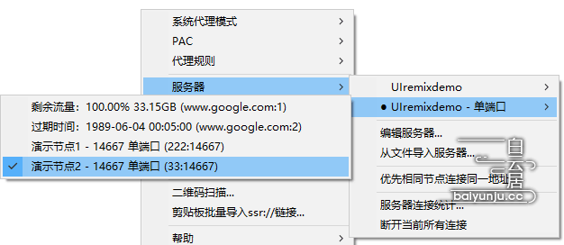

# 如何使用Shadowsocksr

**提示:Shadowsocksr作者因为其它原因，其客户端最后更新于2019年4月21日。**

将SSR压缩文件解压后，文件如下：

<figure><figcaption></figcaption></figure>

细心的老用户可能会发现，刚解压的ShadowsocksR目录内没有以下文件：

* pac.txt　（PAC域名列表）
* user-rule.txt 　（用户规则域名列表）
* 一些其他节点配置等文件

并不是ShadowsocksR软件不完整，暂时缺少的这些文件不是必需的，随着接下来的设置，如果需要使用PAC代理模式，会自动生成或下载。

其实，如果解压后，发现SSR目录内的文件比上面图片中的多，未必是好事，因为说明该压缩包可能不是官方原版的了，是被别人修改过的，或者是直接打包自己电脑中的目录。

**启动SSR软件，点击“ShadowsocksR-dotnet4.0.exe”文件**，如果无法启动就点击“ShadowsocksR-dotnet2.0.exe”。

### 第二步：SSR“系统代理模式”“代理规则”怎么选择？

SSR的代理模式和代理规则应该选择哪一个呢？白云居丨baiyunju.cc建议先暂时使用官方默认设置，然后再考虑其他自定义代理模式。

启动ShadowsocksR电脑客户端后，会发现默认代理设置状态为：

* **系统代理模式 – 选择了“全局模式”**
* PAC – 默认没有启用，未选择
* **代理规则 – 选择了“绕过局域网和大陆”**
* 保持当前状态不修改 – 意思是保持电脑系统的代理状态不修改，未选择

如下图所示：

<figure><figcaption></figcaption></figure>

<figure><figcaption></figcaption></figure>

也就是**SSR官方默认选择的代理模式为：“全局模式”+“绕过局域网和大陆”**，保持默认即可。

以上默认选择的代理模式，可达到的效果是：**电脑内所有的浏览器流量全部通过ShadowsocksR软件连接，并且按照“绕过局域网和大陆”的代理规则，进行智能分流。**也就是说，中国大陆的IP、域名不走代理，其他国外的流量走代理。

其实，这样的代理规则设置可以满足绝大部分用户需要，如果没有特殊需求，保持默认就可以了，不需要自己设置。

**提示：**

SSR默认设置下，选择了**“服务器负载均衡”**，意思是代理的流量，自动、轮流选择不同的服务器节点来连接，以保持各个代理服务器的负载均衡，避免有的节点累死、有的节点闲死，但不建议开启此选项。

### 第三步：在ShadowsocksR（SSR）电脑端添加节点、服务器订阅地址的方法

开始导入节点，在电脑端SSR软件中添加节点的方法有三种：

#### 1、扫描节点二维码

使SSR节点二维码显示于电脑屏幕上，右键点击任务栏中的小飞机图标，选择“二维码扫描”，即可自动识别二维码并添加服务器节点。

#### 2、剪贴板批量导入多个ssr://链接

复制一条、或多条SSR节点地址，然后右键点击小飞机图标，选择“剪贴板批量导入ssr://链接..”，即可将复制的节点添加到服务器列表内。

#### 3、添加SSR节点订阅地址

**注意：此方法有可能会出问题不推荐！！！！！！！！**

在免费或收费的机场中，复制SSR订阅链接地址链接。

然后，右键点击小飞机图标，依次选择“服务器订阅”-“SSR服务器订阅设置”，如下图所示：

<figure><figcaption>
图片丨添加SSR服务器订阅地址
</figcaption></figure>

在订阅设置界面，点击“Add”，在“网址”栏内粘贴进刚才复制的SRR服务器节点链接，“组名”不用填写，点击“确定”，如下图：

<figure><figcaption>
图片丨粘贴SSR订阅链接地址
</figcaption></figure>

下一步，右键点击电脑任务栏粉红色（代理状态不同也可能是灰色、黄色等）纸飞机图标，选择“服务器订阅”-**“更新SSR服务器订阅”**。

如果更新服务器订阅不成功，就选择**“更新SSR服务器订阅（不通过代理）”**。

如果还是不能更新SSR节点订阅，就**重启ShadowsocksR软件，然后再执行“更新SSR服务器订阅（不通过代理）”**。

更新SSR服务器订阅如果成功，注意看，电脑右下角会有弹窗提示（电脑系统版本、设置不同，也可能没有通知）。

然后，就可以选择服务器订阅群组中的节点了，右键点击纸飞机图标，选择“服务器”-“所订阅群组的名称”-点击选择节点，如下图所示：

<figure><figcaption>
图片丨选择SSR服务器节点
</figcaption></figure>

看上图，所选节点组上面还有一个节点组，进入“编辑服务器”界面，选中不用的节点，再“删除”即可消失。

**到这里，通过ShadowsocksR就能够科学上外网了。**

**贴心提醒：请勿将ShadowsocksR和V2rayN混用！！！！**

来源：[**https://baiyunju.cc/8508**](https://baiyunju.cc/8508)
