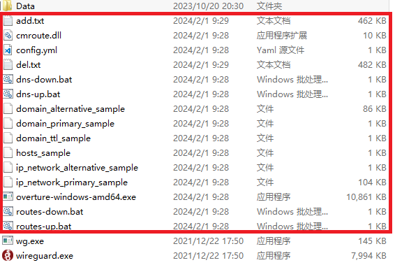

# 如何使用WireGuard配合WARP进行科学上网

最近由于WARP封控严重，请切换到IPv6访问(若IPv6失效请尝试IPv4)

条件:请注册一个Replit账号并务必打开WARP代理模式否则无法识别

1.下载并安装WireGuard:[https://www.wireguard.com/install/](https://www.wireguard.com/install/)

2.打开[https://replit.com/@misaka-blog/wgcf-profile-generator](https://replit.com/@misaka-blog/wgcf-profile-generator) 或 [https://replit.com/@misaka-blog/warpgo-profile-generator](https://replit.com/@misaka-blog/warpgo-profile-generator),点击"Fork——Run"

3.依据情况选择(这里为团队账户为例)

团队账户申请:[zero.md](../other/zero.md "mention")

<figure><figcaption></figcaption></figure>

4.依据提示获取Token并复制:

<figure><figcaption></figcaption></figure>

<figure><figcaption></figcaption></figure>

<figure><figcaption></figcaption></figure>

<figure><figcaption></figcaption></figure>

<figure><figcaption><p>被遮挡部分即为Token</p></figcaption></figure>

5.获取信息如下

<figure><figcaption></figcaption></figure>

6.复制上述配置信息，打开WireGuard，点击"新建新隧道"

<figure><figcaption></figcaption></figure>

7.粘贴配置文件至此

<figure><figcaption></figcaption></figure>

8.点击连接，出现如图即为连接成功

<figure><figcaption></figcaption></figure>

提示:

1.如为 WARP-GO 的话也会提取 Sing-box 配置文件

2.寻找并修改可用的EndPoint IP及端口

可用端口：500、854、859、864、878、880、890、891、894、903、908、928、934、939、942、943、945、946、955、968、987、988、1002、1010、1014、1018、1070、1074、1180、1387、1701、1843、2371、2408、2506、3138、3476、3581、3854、4177、4198、4233、4500、5279、5956、7103、7152、7156、7281、7559、8319、8742、8854、8886

Endpoint IPV4地址：

```
162.159.192.1（1的取值范围0-254）
162.159.193.1（1的取值范围0-254）
162.159.195.1（1的取值范围0-254）
162.159.204.1（1的取值范围0-254）
188.114.96.1（1的取值范围0-254）
188.114.97.1（1的取值范围0-254）
188.114.98.1（1的取值范围0-254）
188.114.99.1（1的取值范围0-254）
```

Endpoint IPV6地址：

```
[2606:4700:d0::]
[2606:4700:d1::]

::后可增加取值xxxx:xxxx，举例：2606:4700:d1::1111:1111，取值范围不再赘述，自行谷歌，填入客户端没报错，说明取值可用
```

如嫌自己寻找可用的 Endpoint IP 太麻烦，可以使用[教程](warp.md)中的方法优选。

#### 2024年更新:自动分流

1.管理员cmd运行如下命令:

```
reg add HKLM\Software\WireGuard /v DangerousScriptExecution /t REG_DWORD /d 1 /f
```

2.进入[这里](https://github.com/lmc999/auto-add-routes/blob/master/zip/wireguard.zip)下载"wireguard.zip"并将里面的内容解压到WireGuard的安装目录

<figure><figcaption></figcaption></figure>

3.修改WireGuard节点配置文件。在MTU下方加入以下内容。取消勾选拦截未经隧道的流量前面的复选框。重新连接，之后就可以正常分流了。

注意:"C:\Program Files\WireGuard\\"为你的Wireguard安装地址。

```
PreUp = "C:\Program Files\WireGuard\routes-up.bat"
PostUp = "C:\Program Files\WireGuard\dns-up.bat"
PreDown = "C:\Program Files\WireGuard\routes-down.bat"
PostDown = "C:\Program Files\WireGuard\dns-down.bat"
```

注意：如果你想上ChatGPT,试试搭配赛风使用。
